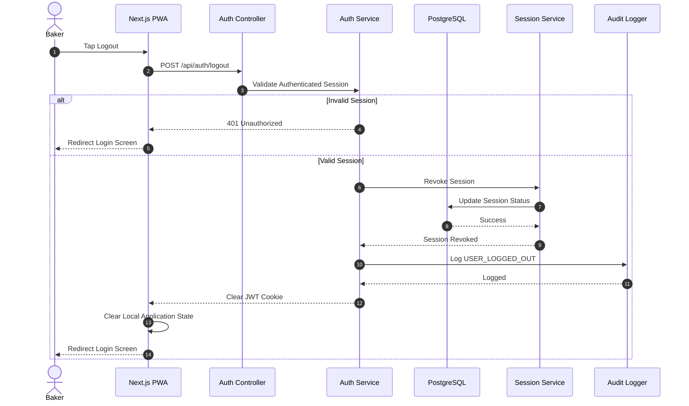

# ARCHITECTURE DECISIONS — Kamai Backend OMS

> Records of significant architectural decisions made during the project.
> Format: ADR (Architecture Decision Record)

---

## ADR-001 — Use Fastify instead of Express

**Date:** 2026-07-25
**Status:** ✅ Accepted

### Context

Need a Node.js HTTP framework for the Kamai OMS backend.

### Decision

Use **Fastify 4.x** as the primary HTTP framework.

### Rationale

- ~3x higher throughput than Express in benchmarks
- First-class TypeScript support with generics
- Plugin ecosystem (helmet, cors, cookie, rate-limit, swagger) maintained by the Fastify team
- Schema-based validation built-in (works alongside Zod)
- Native support for JSON serialization optimization
- Built-in support for structured logging via Pino

### Consequences

- Fastify plugins must be wrapped with `fastify-plugin` to share scope
- Route schema definitions slightly more verbose than Express
- Team must learn Fastify plugin lifecycle

---

## ADR-002 — Use JWT + HttpOnly Cookies for Authentication

**Date:** 2026-07-25
**Status:** ✅ Accepted

### Context

Need a secure authentication mechanism for the Kamai web app.

### Decision

Use **short-lived JWT access tokens** stored in **HttpOnly cookies** combined with **refresh token rotation**.

### Rationale

- HttpOnly cookies prevent XSS-based token theft (JS cannot access)
- Short-lived access tokens (15m) minimize exposure window
- Refresh token rotation invalidates previous tokens on use (prevents replay)
- Cookies with `Secure` + `SameSite=Strict` mitigate CSRF in production
- No need for client-side token storage management

### Consequences

- Must implement cookie clearing on logout
- Refresh token rotation requires DB storage for tracking active sessions
- Cross-domain deployments (different backend/frontend domains) require `SameSite=None; Secure`

---

## ADR-003 — Use Prisma ORM instead of raw SQL / Drizzle / TypeORM

**Date:** 2026-07-25
**Status:** ✅ Accepted

### Context

Need an ORM for PostgreSQL with strong TypeScript support.

### Decision

Use **Prisma 5.x** as the ORM.

### Rationale

- Auto-generated type-safe client eliminates `any` types in DB layer
- Migration system with history tracking (`prisma migrate`)
- Prisma Studio for quick data inspection
- Schema-as-code with relations, indexes, and constraints
- Works natively with Supabase PostgreSQL
- Large ecosystem and documentation

### Consequences

- Generated client must be regenerated after schema changes
- Prisma Client is heavier than raw SQL drivers
- Complex queries may still require `$queryRaw` (documented in KNOWN_ISSUES)

---

## ADR-004: Soft Delete for Financial Records

**Context**: Records like Investments and PaymentLedgers cannot be permanently deleted (hard delete) to maintain financial integrity and auditability.
**Decision**: Implement a `deletedAt` DateTime field on financial models. Queries must explicitly filter by `deletedAt: null`. This preserves the data but removes it from operational visibility.
**Status**: Accepted

---

## ADR-005: Subscription Management via Razorpay AutoPay

**Context**: We need a reliable mechanism to handle recurring subscription billing (₹149/month Early Adopter plan).
**Decision**: Use Razorpay Subscriptions with UPI AutoPay. We will use the official `razorpay` Node.js SDK and abstract it behind a `PaymentGateway` interface in `src/shared/payment/` to allow for future provider migrations (e.g., Stripe). Subscription state (Trial, Pending, Active, Paused, Expired, Cancelled) will be driven primarily by webhook events rather than client callbacks.
**Status**: Accepted

---

## ADR-006: Webhook Processing Idempotency

**Context**: Webhook processing must be idempotent, safe to retry, and crash-resistant.
**Decision**: Webhook processing is idempotent using persistent database event tracking. We introduce a `WebhookEvent` table to track processed event IDs rather than depending on a Redis-based locking mechanism. This prevents duplicate processing, supports safe retries, allows crash recovery, and eliminates the need for an additional infrastructure dependency.
**Status**: Accepted

---

## ADR-007 — Use Zod for Validation

**Date:** 2026-07-25
**Status:** ✅ Accepted

- Fastify's JSON Schema validation (`ajv`) disabled in favour of Zod
- All route schemas must be written as both Zod schemas (for runtime) and JSON Schema (for Swagger docs)

---

## ADR-005 — Use Supabase as PostgreSQL Provider + Storage

**Date:** 2026-07-25
**Status:** ✅ Accepted (pending credential configuration)

### Context

Need a hosted PostgreSQL database and file storage for production.

### Decision

Use **Supabase** for both the PostgreSQL database and object storage.

### Rationale

- Managed PostgreSQL with connection pooling (pgBouncer)
- Built-in storage with CDN — eliminates need for separate S3 setup
- Row-level security (optional) for future multi-tenancy
- CLI tools for local development
- Compatible with Prisma via standard PostgreSQL connection string

### Consequences

- Requires Supabase project creation and credential provisioning
- Storage bucket must be configured before file upload actions
- Direct database connections must use `DIRECT_URL` for migrations

---

## ADR-006 — Use BullMQ + Redis for Background Jobs

**Date:** 2026-07-25
**Status:** ✅ Accepted (pending Redis URL)

### Context

Need background job processing for notifications, invoices, and scheduled tasks.

### Decision

Use **BullMQ** (backed by **Redis**) for the job queue.

### Rationale

- Battle-tested job queue built specifically for Redis
- Supports retries, delays, priorities, rate limiting per queue
- TypeScript-native
- Worker pattern separates job processing from HTTP layer
- Redis also serves as the caching layer (dual purpose)

### Consequences

- Redis is a required infrastructure dependency
- Jobs must be idempotent (retries may execute the same job multiple times)
- Separate worker processes needed for production scaling

---

## ADR-007 — Use Argon2 for Password Hashing

**Date:** 2026-07-25
**Status:** ✅ Accepted

### Context

Need secure password hashing for baker accounts.

### Decision

Use **Argon2** (specifically Argon2id variant) for password hashing.

### Rationale

- Winner of the Password Hashing Competition (2015)
- More resistant to GPU attacks than bcrypt and scrypt
- Argon2id variant provides best balance of resistance to side-channel and brute-force attacks
- Memory-hard algorithm — raises cost of brute-force significantly

### Consequences

- Argon2 requires native bindings — must include build tools in Dockerfile
- Slightly slower hash verification compared to bcrypt (intentional security property)

---

## ADR-008 — Use Pino for Structured Logging

**Date:** 2026-07-25
**Status:** ✅ Accepted

### Context

Need a production-grade logging solution.

### Decision

Use **Pino** for structured JSON logging with pino-pretty in development.

### Rationale

- Fastest Node.js logger (benchmarked against Winston, Bunyan)
- Fastify uses Pino natively — zero overhead integration
- Structured JSON output — directly compatible with log aggregation (Datadog, Grafana Loki, CloudWatch)
- Field redaction prevents sensitive data leaking into logs
- Pretty-printing in development for readability

### Consequences

- Dev requires `pino-pretty` installed as dev dependency
- Log aggregation pipeline must parse JSON (not plaintext)

---

## ADR-009 — Authentication migrated from AuthKey SMS OTP to Firebase Phone Authentication

**Date:** 2026-07-25
**Status:** ✅ Accepted

### Context

The original authentication design for Kamai relied on **AuthKey** as the SMS OTP provider. This approach required:

- DLT (Distributed Ledger Technology) registration for Indian SMS compliance
- A third-party SMS provider account and API credentials
- Backend-managed OTP generation, storage (Redis), and manual verification
- Retry/expiry logic owned by the backend

AuthKey credentials were never provisioned and the integration was never implemented. The dependency on DLT registration created a significant onboarding blocker.

### Decision

Replace AuthKey SMS OTP with **Firebase Phone Authentication** as the sole identity verification mechanism for baker login.

The client is the **Kamai web app (browser-based)**. There is no Android or mobile app.

The new authentication flow is:

1. Web app collects the baker's phone number
2. Firebase JS SDK sends OTP to the baker's phone (managed entirely by Google)
3. Baker enters OTP in the web app
4. Firebase JS SDK verifies the OTP and returns a **Firebase ID Token**
5. Web app sends the Firebase ID Token to the Kamai backend
6. Backend verifies the token using **Firebase Admin SDK**
7. Backend creates the baker account (first login) or fetches the existing account
8. Backend issues a Kamai **JWT access token** and **refresh token**
9. Access token and refresh token are set as **HttpOnly cookies** (browser-safe, XSS-resistant)

### Rationale

- **No DLT dependency** — Google manages Indian telecom compliance for Firebase-delivered OTPs
- **No SMS provider dependency** — No third-party account, credentials, or billing setup required
- **Better security** — OTP generation, delivery, and verification are fully managed by Google infrastructure; the backend never handles raw OTPs
- **Google-managed OTP delivery** — Handles retry, rate limiting, and multi-region delivery automatically
- **Simpler backend** — Backend responsibility reduces to: verify Firebase ID Token → create/fetch baker → issue JWT. No OTP storage, no expiry timers, no retry logic
- **Faster onboarding** — No DLT registration blocker; Firebase project can be configured in minutes

### Backend Responsibilities (Post-Decision)

| Responsibility                          | Backend                            |
| --------------------------------------- | ---------------------------------- |
| Generate OTP                            | ❌ Firebase only                   |
| Send SMS                                | ❌ Firebase only                   |
| Verify OTP                              | ❌ Firebase only                   |
| Retry OTP                               | ❌ Firebase only                   |
| Verify Firebase ID Token                | ✅ Firebase Admin SDK              |
| Create baker on first login             | ✅ Prisma / PostgreSQL             |
| Issue Kamai JWT access token            | ✅ JWT (15m)                       |
| Issue Kamai refresh token               | ✅ JWT (7d) + DB storage           |
| Set HttpOnly cookies (access + refresh) | ✅ Fastify Cookie (browser client) |

### New Environment Variables Required

| Variable                  | Purpose                            |
| ------------------------- | ---------------------------------- |
| `FIREBASE_PROJECT_ID`   | Firebase Admin SDK initialisation  |
| `FIREBASE_CLIENT_EMAIL` | Firebase Admin SDK service account |
| `FIREBASE_PRIVATE_KEY`  | Firebase Admin SDK service account |

### Consequences

- `firebase-admin` npm package must be added as a project dependency
- Baker accounts are keyed by Firebase UID (`firebaseUid`) in addition to phone number
- No OTP-related tables or Redis keys will be created
- ADR-007 (Argon2 password hashing) is now irrelevant to the phone auth flow — Argon2 may still be used for any future password-based admin flows
- All previous references to AuthKey, OTP generation, or SMS provider setup are **superseded** by this decision

---

## ADR-008 — Server-side Refresh Token Revocation & Decoupled Session Management

**Date:** 2026-07-26
**Status:** ✅ Accepted

### Context

Need secure session termination for Kamai without coupling backend logout to external identity providers.

### Decision

Session management uses server-side refresh token revocation with HttpOnly cookies.

### Rationale

- Stateless access tokens
- Secure refresh token rotation
- Per-device logout
- Firebase remains identity provider only

### Consequences

- Backend invalidates Kamai JWT session by updating `revokedAt` timestamp on the active `RefreshToken` DB record
- Client (Android/PWA) handles Firebase `signOut()` independently

One thing I would improve from the original Firebase version is that **Logout should become completely session-driven**.

Since we're removing Firebase entirely, there is **no concept of Firebase Sign Out** anymore.

Logout should only invalidate the Kamai session and clear the JWT cookie.

Everything else remains exactly the same.

---

# Sequence Diagram 24 — Logout

## Action

> Baker taps **Logout** from the Profile / Settings screen.

---

## API

```http
POST /api/auth/logout
```

---

## Payload

```json
{}
```

No request body is required. The authenticated session is identified using the secure HTTP-only JWT cookie.

---

# Participants

* Baker
* Next.js PWA
* Auth Controller
* Auth Service
* PostgreSQL (Supabase)
* Session Service
* Audit Logger

---



---

# Backend Flow

```text
User
   │
   ▼
POST /api/auth/logout
   │
   ▼
Validate JWT
   │
   ▼
Find Active Session
   │
   ▼
Revoke Session
   │
   ▼
Clear JWT Cookie
   │
   ▼
Audit Log
   │
   ▼
Redirect Login Screen
```

---

# Database Operations

## Find Active Session

```sql
SELECT *
FROM sessions
WHERE session_id = :sessionId
AND revoked_at IS NULL;
```

---

## Revoke Session

```sql
UPDATE sessions
SET
    revoked_at = NOW(),
    updated_at = NOW()
WHERE
    session_id = :sessionId;
```

---

# Cookie Management

On successful logout, the backend clears the authentication cookies.

```text
kamai_access_token
        │
        ▼
Clear Cookie

kamai_refresh_token
        │
        ▼
Clear Cookie
```

Cookie attributes:

```text
HttpOnly
Secure
SameSite=Lax
Expires=Thu, 01 Jan 1970
```

This immediately invalidates the browser's authenticated state.

---

# Frontend Cleanup

The frontend performs local cleanup only.

```text
Clear User Context
        │
        ▼
Clear React State
        │
        ▼
Clear Cached API Data
        │
        ▼
Navigate to Login Screen
```

> **Note:** The frontend does **not** store or remove JWT tokens directly. Authentication is managed using secure HTTP-only cookies.

---

# Success Response

```json
{
    "success": true,
    "message": "Logged out successfully."
}
```

---

# Error Flows

### Session Already Expired

```text
JWT Validation
      │
      ▼
Session Invalid
      ▼
401 Unauthorized
      ▼
Redirect Login
```

---

### Database Failure

```text
Revoke Session
       │
       ▼
Database Error
       ▼
500 Internal Server Error
       ▼
Retry Later
```

---

### Audit Failure

```text
Logout Successful
       │
       ▼
Audit Logging Failed
       │
       ▼
Log Internally
       │
       ▼
Return Success
```

> Logout should **not fail** because the audit log could not be written. The session revocation takes precedence.

---

# Security Flow

```text
JWT Cookie
     │
     ▼
Validate Signature
     │
     ▼
Find Active Session
     │
     ▼
Revoke Session
     │
     ▼
Clear Authentication Cookies
     │
     ▼
Redirect to Login
```

---

# Business Rules

* Authentication is performed using the existing **HTTP-only JWT cookie**.
* No request body is required.
* The current session is revoked by setting `revoked_at`.
* Both access and refresh token cookies are cleared.
* The frontend removes only local UI/application state; it never handles JWT values directly.
* Every successful logout is recorded as `USER_LOGGED_OUT` in the audit log.
* Logout is **idempotent**. If the session is already invalid, the user is redirected to the login screen without exposing internal session details.
* This action is **completely independent of Firebase**. There is no Firebase SDK, Firebase Sign Out, or third-party identity provider involved. Kamai owns the full authentication lifecycle through its session and JWT infrastructure.

---

## Difference from the Previous Firebase Architecture

### Previous Flow

```text
Logout
    │
    ▼
Firebase Sign Out
    │
    ▼
Backend Logout
    │
    ▼
Redirect Login
```

### New Flow

```text
Logout
    │
    ▼
POST /api/auth/logout
    │
    ▼
Validate JWT
    │
    ▼
Revoke Session
    │
    ▼
Clear HttpOnly Cookies
    │
    ▼
Redirect Login
```

The new design is cleaner because the **Kamai backend is now the single source of truth for authentication and session management**. There are no external authentication dependencies, making logout faster, simpler, and easier to maintain.
